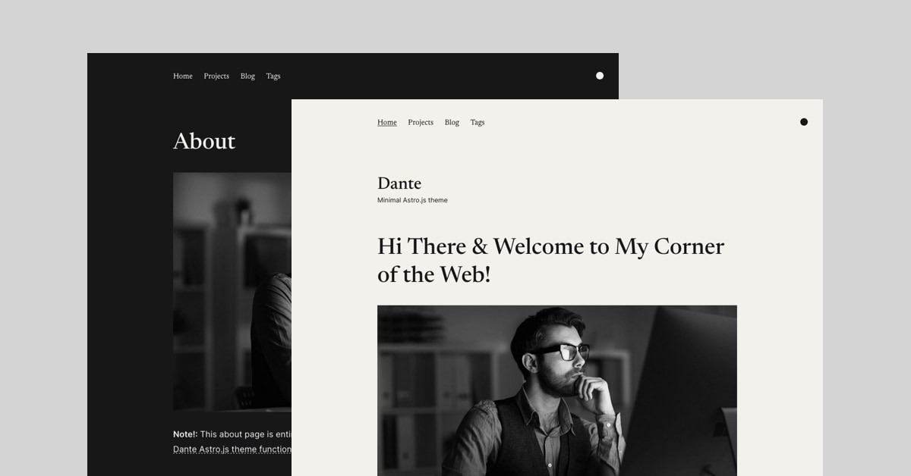

# .astro/astro/content.d.ts

```ts
declare module 'astro:content' {
	interface Render {
		'.mdx': Promise<{
			Content: import('astro').MarkdownInstance<{}>['Content'];
			headings: import('astro').MarkdownHeading[];
			remarkPluginFrontmatter: Record<string, any>;
			components: import('astro').MDXInstance<{}>['components'];
		}>;
	}
}

declare module 'astro:content' {
	interface RenderResult {
		Content: import('astro/runtime/server/index.js').AstroComponentFactory;
		headings: import('astro').MarkdownHeading[];
		remarkPluginFrontmatter: Record<string, any>;
	}
	interface Render {
		'.md': Promise<RenderResult>;
	}

	export interface RenderedContent {
		html: string;
		metadata?: {
			imagePaths: Array<string>;
			[key: string]: unknown;
		};
	}
}

declare module 'astro:content' {
	type Flatten<T> = T extends { [K: string]: infer U } ? U : never;

	export type CollectionKey = keyof AnyEntryMap;
	export type CollectionEntry<C extends CollectionKey> = Flatten<AnyEntryMap[C]>;

	export type ContentCollectionKey = keyof ContentEntryMap;
	export type DataCollectionKey = keyof DataEntryMap;

	type AllValuesOf<T> = T extends any ? T[keyof T] : never;
	type ValidContentEntrySlug<C extends keyof ContentEntryMap> = AllValuesOf<
		ContentEntryMap[C]
	>['slug'];

	/** @deprecated Use `getEntry` instead. */
	export function getEntryBySlug<
		C extends keyof ContentEntryMap,
		E extends ValidContentEntrySlug<C> | (string & {}),
	>(
		collection: C,
		// Note that this has to accept a regular string too, for SSR
		entrySlug: E,
	): E extends ValidContentEntrySlug<C>
		? Promise<CollectionEntry<C>>
		: Promise<CollectionEntry<C> | undefined>;

	/** @deprecated Use `getEntry` instead. */
	export function getDataEntryById<C extends keyof DataEntryMap, E extends keyof DataEntryMap[C]>(
		collection: C,
		entryId: E,
	): Promise<CollectionEntry<C>>;

	export function getCollection<C extends keyof AnyEntryMap, E extends CollectionEntry<C>>(
		collection: C,
		filter?: (entry: CollectionEntry<C>) => entry is E,
	): Promise<E[]>;
	export function getCollection<C extends keyof AnyEntryMap>(
		collection: C,
		filter?: (entry: CollectionEntry<C>) => unknown,
	): Promise<CollectionEntry<C>[]>;

	export function getEntry<
		C extends keyof ContentEntryMap,
		E extends ValidContentEntrySlug<C> | (string & {}),
	>(entry: {
		collection: C;
		slug: E;
	}): E extends ValidContentEntrySlug<C>
		? Promise<CollectionEntry<C>>
		: Promise<CollectionEntry<C> | undefined>;
	export function getEntry<
		C extends keyof DataEntryMap,
		E extends keyof DataEntryMap[C] | (string & {}),
	>(entry: {
		collection: C;
		id: E;
	}): E extends keyof DataEntryMap[C]
		? Promise<DataEntryMap[C][E]>
		: Promise<CollectionEntry<C> | undefined>;
	export function getEntry<
		C extends keyof ContentEntryMap,
		E extends ValidContentEntrySlug<C> | (string & {}),
	>(
		collection: C,
		slug: E,
	): E extends ValidContentEntrySlug<C>
		? Promise<CollectionEntry<C>>
		: Promise<CollectionEntry<C> | undefined>;
	export function getEntry<
		C extends keyof DataEntryMap,
		E extends keyof DataEntryMap[C] | (string & {}),
	>(
		collection: C,
		id: E,
	): E extends keyof DataEntryMap[C]
		? Promise<DataEntryMap[C][E]>
		: Promise<CollectionEntry<C> | undefined>;

	/** Resolve an array of entry references from the same collection */
	export function getEntries<C extends keyof ContentEntryMap>(
		entries: {
			collection: C;
			slug: ValidContentEntrySlug<C>;
		}[],
	): Promise<CollectionEntry<C>[]>;
	export function getEntries<C extends keyof DataEntryMap>(
		entries: {
			collection: C;
			id: keyof DataEntryMap[C];
		}[],
	): Promise<CollectionEntry<C>[]>;

	export function render<C extends keyof AnyEntryMap>(
		entry: AnyEntryMap[C][string],
	): Promise<RenderResult>;

	export function reference<C extends keyof AnyEntryMap>(
		collection: C,
	): import('astro/zod').ZodEffects<
		import('astro/zod').ZodString,
		C extends keyof ContentEntryMap
			? {
					collection: C;
					slug: ValidContentEntrySlug<C>;
				}
			: {
					collection: C;
					id: keyof DataEntryMap[C];
				}
	>;
	// Allow generic `string` to avoid excessive type errors in the config
	// if `dev` is not running to update as you edit.
	// Invalid collection names will be caught at build time.
	export function reference<C extends string>(
		collection: C,
	): import('astro/zod').ZodEffects<import('astro/zod').ZodString, never>;

	type ReturnTypeOrOriginal<T> = T extends (...args: any[]) => infer R ? R : T;
	type InferEntrySchema<C extends keyof AnyEntryMap> = import('astro/zod').infer<
		ReturnTypeOrOriginal<Required<ContentConfig['collections'][C]>['schema']>
	>;

	type ContentEntryMap = {
	"articles": Record<string, {
  id: string;
  slug: string;
  body: string;
  collection: "article";
  data: InferEntrySchema<"article">;
  render(): Render[".md"];
}>;
"articles": {
"post-1.md": {
	id: "post-1.md";
  slug: "post-1";
  body: string;
  collection: "articles";
  data: any
} & { render(): Render[".md"] };
};
"pages": {
"about.md": {
	id: "about.md";
  slug: "about";
  body: string;
  collection: "pages";
  data: InferEntrySchema<"pages">
} & { render(): Render[".md"] };
"contact.md": {
	id: "contact.md";
  slug: "contact";
  body: string;
  collection: "pages";
  data: InferEntrySchema<"pages">
} & { render(): Render[".md"] };
};
"projects": {
"project-1.md": {
	id: "project-1.md";
  slug: "project-1";
  body: string;
  collection: "projects";
  data: InferEntrySchema<"projects">
} & { render(): Render[".md"] };
};

	};

	type DataEntryMap = {

	};

	type AnyEntryMap = ContentEntryMap & DataEntryMap;

	export type ContentConfig = typeof import("../../src/content/config.js");
}

```

# .astro/settings.json

```json
{
	"_variables": {
		"lastUpdateCheck": 1731635416812
	}
}
```

# .astro/types.d.ts

```ts
/// <reference types="astro/client" />
/// <reference path="astro/content.d.ts" />
```

# .gitignore

```
# build output
dist/
# generated types
.astro/

# dependencies
node_modules/

# logs
npm-debug.log*
yarn-debug.log*
yarn-error.log*
pnpm-debug.log*


# environment variables
.env
.env.production

# macOS-specific files
.DS_Store

```

# .prettierrc

```
{
    "printWidth": 160,
    "singleQuote": true,
    "trailingComma": "none",
    "tabWidth": 4,
    "overrides": [
        {
            "files": ["*.md", "*.mdx", "*.yaml"],
            "options": {
                "tabWidth": 2
            }
        }
    ]
}

```

# .vscode/extensions.json

```json
{
  "recommendations": ["astro-build.astro-vscode"],
  "unwantedRecommendations": []
}

```

# .vscode/launch.json

```json
{
  "version": "0.2.0",
  "configurations": [
    {
      "command": "./node_modules/.bin/astro dev",
      "name": "Development server",
      "request": "launch",
      "type": "node-terminal"
    }
  ]
}

```

# .vscode/settings.json

```json
{
    "editor.tabSize": 4,
    "editor.formatOnSave": true,
    "editor.codeActionsOnSave": {
        "source.fixAll.eslint": "explicit"
    },
    "[javascript]": {
        "editor.defaultFormatter": "esbenp.prettier-vscode",
        "editor.formatOnSave": true
    },
    "[yaml]": {
        "editor.defaultFormatter": "esbenp.prettier-vscode",
        "editor.tabSize": 2
    },
    "[toml]": {
        "editor.defaultFormatter": "esbenp.prettier-vscode",
        "editor.tabSize": 2
    },
    "[markdown]": {
        "editor.defaultFormatter": "esbenp.prettier-vscode",
        "editor.tabSize": 2
    },
    "typescript.tsdk": "node_modules/typescript/lib",
    "files.associations": {
        "*.css": "tailwindcss",
    }
}

```

# astro.config.mjs

```mjs
import { defineConfig } from 'astro/config';
import mdx from '@astrojs/mdx';
import sitemap from '@astrojs/sitemap';
import tailwind from '@astrojs/tailwind';

// https://astro.build/config
export default defineConfig({
    site: 'https://example.com',
    integrations: [
        mdx(),
        sitemap(),
        tailwind({
            applyBaseStyles: false
        })
    ]
});

```

# package.json

```json
{
    "name": "dante-astro-theme",
    "type": "module",
    "version": "0.0.1",
    "scripts": {
        "dev": "astro dev",
        "start": "astro dev",
        "build": "astro build",
        "preview": "astro preview",
        "astro": "astro"
    },
    "dependencies": {
        "@astrojs/mdx": "^3.1.9",
        "@astrojs/rss": "^4.0.9",
        "@astrojs/sitemap": "^3.2.1",
        "@astrojs/tailwind": "^5.1.2",
        "astro": "^4.16.12",
        "marked": "^15.0.0",
        "tailwindcss": "^3.4.14"
    },
    "devDependencies": {
        "@tailwindcss/typography": "^0.5.15",
        "prettier": "^3.3.3",
        "prettier-plugin-tailwindcss": "^0.6.8"
    }
}

```

# public/about.jpeg

This is a binary file of the type: Image

# public/dante-preview.jpg

This is a binary file of the type: Image

# public/favicon.svg

This is a file of the type: SVG Image

# public/hero.jpeg

This is a binary file of the type: Image

# public/post-1.jpg

This is a binary file of the type: Image

# public/post-2.jpg

This is a binary file of the type: Image

# public/post-3.jpg

This is a binary file of the type: Image

# public/post-4.jpg

This is a binary file of the type: Image

# public/post-5.jpg

This is a binary file of the type: Image

# public/post-6.jpg

This is a binary file of the type: Image

# public/post-7.jpg

This is a binary file of the type: Image

# public/post-8.jpg

This is a binary file of the type: Image

# public/post-9.jpg

This is a binary file of the type: Image

# public/post-10.jpg

This is a binary file of the type: Image

# public/post-11.jpg

This is a binary file of the type: Image

# public/post-12.jpg

This is a binary file of the type: Image

# public/post-13.jpg

This is a binary file of the type: Image

# public/post-14.jpg

This is a binary file of the type: Image

# public/project-1.jpg

This is a binary file of the type: Image

# public/project-2.jpg

This is a binary file of the type: Image

# public/project-3.jpg

This is a binary file of the type: Image

# public/project-4.jpg

This is a binary file of the type: Image

# public/project-5.jpg

This is a binary file of the type: Image

# public/project-6.jpg

This is a binary file of the type: Image

# public/project-7.jpg

This is a binary file of the type: Image

# README.md

```md
# Dante - Astro & Tailwind CSS Theme by justgoodui.com

Dante is a single-author article and portfolio theme for Astro.js. Featuring a minimal, slick, responsive and content-focused design. For more Astro.js themes please check [justgoodui.com](https://justgoodui.com/).



[](https://app.netlify.com/start/deploy?repository=https://github.com/JustGoodUI/dante-astro-theme)

If you click this☝️ button, it will create a new repo for you that looks exactly like this one, and sets that repo up immediately for deployment on Netlify.

## Theme Features:

- ✅ Dark and light color mode
- ✅ Hero section with bio
- ✅ Portfolio collection
- ✅ Pagination support
- ✅ Post tags support
- ✅ Subscription form
- ✅ View transitions
- ✅ Tailwind CSS
- ✅ Mobile-first responsive layout
- ✅ SEO-friendly with canonical URLs and OpenGraph data
- ✅ Sitemap support
- ✅ RSS Feed support
- ✅ Markdown & MDX support

## Template Integrations

- @astrojs/tailwind - https://docs.astro.build/en/guides/integrations-guide/tailwind/
- @astrojs/sitemap - https://docs.astro.build/en/guides/integrations-guide/sitemap/
- @astrojs/mdx - https://docs.astro.build/en/guides/markdown-content/
- @astrojs/rss - https://docs.astro.build/en/guides/rss/

## Project Structure

Inside of Dante Astro theme, you'll see the following folders and files:

\`\`\`text
├── public/
├── src/
│   ├── components/
│   ├── content/
│   ├── data/
│   ├── icons/
│   ├── layouts/
│   ├── pages/
│   ├── styles/
│   └── utils/
├── astro.config.mjs
├── package.json
├── README.md
├── tailwind.config.cjs
└── tsconfig.json
\`\`\`

Astro looks for `.astro` or `.md` files in the `src/pages/` directory. Each page is exposed as a route based on its file name.

There's nothing special about `src/components/`, but that's where we like to put any Astro (`.astro`) components.

The `src/content/` directory contains "collections" of related Markdown and MDX documents. Use `getCollection()` to retrieve posts from `src/content/article/`, and type-check your frontmatter using an optional schema. See [Astro's Content Collections docs](https://docs.astro.build/en/guides/content-collections/) to learn more.

Any static assets, like images, can be placed in the `public/` directory.

## Astro.js Commands

All commands are run from the root of the project, from a terminal:

| Command                   | Action                                           |
| :------------------------ | :----------------------------------------------- |
| `npm install`             | Installs dependencies                            |
| `npm run dev`             | Starts local dev server at `localhost:4321`      |
| `npm run build`           | Build your production site to `./dist/`          |
| `npm run preview`         | Preview your build locally, before deploying     |
| `npm run astro ...`       | Run CLI commands like `astro add`, `astro check` |
| `npm run astro -- --help` | Get help using the Astro CLI                     |

## Want to learn more about Astro.js?

Check out [our documentation](https://docs.astro.build) or jump into our [Discord server](https://astro.build/chat).

## Credits

- Demo content generate with [Chat GPT](https://chat.openai.com/)
- Images for demo content from [Unsplash](https://unsplash.com/)

## Astro Themes by Just Good UI

- [Ovidius](https://github.com/JustGoodUI/ovidius-astro-theme) is a free single author article theme.

## License

Licensed under the [GPL-3.0](https://github.com/JustGoodUI/dante-astro-theme/blob/main/LICENSE) license.

```

# src/components/BaseHead.astro

```astro
---
import siteConfig from '../data/site-config';
import '../styles/global.css';

export type Props = {
    title?: string;
    description?: string;
    image?: { src: string; alt?: string };
    pageType?: 'website' | 'article';
};

const { description = '', image = siteConfig.image, pageType = 'website' } = Astro.props;
const title = [Astro.props.title, siteConfig.title].filter(Boolean).join(' | ');
const resolvedImage = image?.src
    ? {
          src: new URL(image.src, Astro.site).toString(),
          alt: image.alt
      }
    : undefined;
const canonicalURL = new URL(Astro.request.url, Astro.site);

/**
 * Enforce some standard canonical URL formatting across the site.
 */
function formatCanonicalURL(url: string | URL) {
    const path = url.toString();
    const hasQueryParams = path.includes('?');
    // If there are query params, make sure the URL has no trailing slash
    if (hasQueryParams) {
        path.replace(/\/?$/, '');
    }
    // otherwise, canonical URL always has a trailing slash
    return path.replace(/\/?$/, hasQueryParams ? '' : '/');
}
---

<!-- High Priority Global Metadata -->
<meta charset="utf-8" />
<meta name="viewport" content="width=device-width,initial-scale=1" />
<title>{title}</title>
<meta name="generator" content={Astro.generator} />

<!-- Fonts -->
<link rel="preconnect" href="https://fonts.googleapis.com" />
<link rel="preconnect" href="https://fonts.gstatic.com" crossorigin />
<link
    href="https://fonts.googleapis.com/css2?family=Inter:wght@400..700&family=Newsreader:ital,opsz,wght@0,6..72,400..700;1,6..72,400..700&display=swap"
    rel="stylesheet"
/>

<!-- Low Priority Global Metadata -->
<link rel="icon" type="image/svg+xml" href="/favicon.svg" />
<link rel="sitemap" href="/sitemap-index.xml" />
<link rel="alternate" type="application/rss+xml" href="/rss.xml" title="RSS" />

<!-- Page Metadata -->
<link rel="canonical" href={formatCanonicalURL(canonicalURL)} />
<meta name="description" content={description} />

<!-- Open Graph / Facebook -->
<meta property="og:type" content={pageType} />
<meta property="og:url" content={formatCanonicalURL(canonicalURL)} />
<meta property="og:title" content={title} />
<meta property="og:description" content={description} />
{resolvedImage?.src && <meta property="og:image" content={resolvedImage.src} />}
{resolvedImage?.alt && <meta property="og:image:alt" content={resolvedImage.alt} />}

<!-- X/Twitter -->
<meta property="twitter:card" content="summary_large_image" />
<meta property="twitter:url" content={formatCanonicalURL(canonicalURL)} />
<meta property="twitter:title" content={title} />
<meta property="twitter:description" content={description} />
{resolvedImage?.src && <meta property="twitter:image" content={resolvedImage.src} />}
{resolvedImage?.alt && <meta name="twitter:image:alt" content={resolvedImage?.alt} />}

```

# src/components/Button.astro

```astro
---
import type { HTMLAttributes } from 'astro/types';

type AnchorProps = HTMLAttributes<'a'> & { type?: never };
type ButtonProps = HTMLAttributes<'button'> & { href?: never };

type Props = ButtonProps | AnchorProps;

const { href, class: className, ...rest } = Astro.props;
const buttonClasses =
    'inline-flex items-center justify-center px-6 py-2 font-serif text-sm leading-tight italic  text-main bg-main border border-main rounded-full transition hover:bg-muted';
---

{
    href ? (
        <a href={href} class:list={[buttonClasses, className]} {...rest}>
            <slot />
        </a>
    ) : (
        <button class:list={[buttonClasses, className]} {...rest}>
            <slot />
        </button>
    )
}

```

# src/components/Footer.astro

```astro
---
import siteConfig from '../data/site-config';

const socialLinks = siteConfig.socialLinks || [];
const navLinks = siteConfig.footerNavLinks || [];
---

<footer class="w-full max-w-3xl mx-auto pt-12 pb-10 sm:pt-24 sm:pb-14">
    {
        navLinks.length > 0 && (
            <div class="mb-4 flex flex-wrap gap-x-6 gap-y-1">
                {navLinks.map((link) => (
                    <a class="font-serif hover:underline hover:underline-offset-2" href={link.href}>
                        {link.text}
                    </a>
                ))}
            </div>
        )
    }
    <div
        class:list={[
            'pt-6 flex flex-col gap-4 border-t border-dashed border-main',
            { 'sm:flex-row-reverse sm:justify-between sm:items-center': socialLinks.length > 0 }
        ]}
    >
        {
            socialLinks.length > 0 && (
                <div class="flex flex-wrap gap-x-4 gap-y-1">
                    {socialLinks.map((link) => (
                        <a
                            class="inline-flex items-center justify-center text-sm hover:underline hover:underline-offset-2"
                            href={link.href}
                            target="_blank"
                            rel="noopener noreferer"
                        >
                            {link.text}
                        </a>
                    ))}
                </div>
            )
        }
        <p class="text-sm">
            &copy; {new Date().getFullYear()}&nbsp;<a class="hover:underline hover:underline-offset-2" href="/">{siteConfig.title}</a>. All rights reserved.
        </p>
    </div>
</footer>

```

# src/components/FormattedDate.astro

```astro
---
type Props = { date: Date };

const { date } = Astro.props;
---

<time datetime={date.toISOString()}>
    {
        date.toLocaleDateString('en-us', {
            year: 'numeric',
            month: 'long',
            day: 'numeric'
        })
    }
</time>

```

# src/components/Header.astro

```astro
---
import siteConfig from '../data/site-config';
---

<header class="w-full max-w-3xl mx-auto mb-12 sm:mb-16">
    {
        siteConfig.logo && siteConfig.logo?.src ? (
            <a href="/">
                
            </a>
        ) : (
            <a class="font-serif text-2xl leading-tight font-medium text-theme-foreground sm:text-4xl" href="/">
                {siteConfig.title}
            </a>
        )
    }
    {siteConfig.subtitle && <p class="text-sm leading-tight mt-1">{siteConfig.subtitle}</p>}
</header>

```

# src/components/Hero.astro

```astro
---
import { marked } from 'marked';
import Button from './Button.astro';
import siteConfig from '../data/site-config';

const hero = siteConfig.hero;
---

{
    (hero?.title || hero?.image?.src || hero?.text || (hero?.actions && hero.actions.length > 0)) && (
        <section class="w-full flex flex-col gap-8 mb-16 sm:mb-24">
            {hero.title && <h1 class="text-3xl leading-tight font-serif font-medium sm:text-5xl sm:leading-tight">{hero.title}</h1>}
            {hero.image?.src && (
                <figure>
                    
                    {hero.image.caption && <figcaption class="mt-1.5 text-xs sm:text-sm">{hero.image.caption}</figcaption>}
                </figure>
            )}
            {hero.text && <div class="max-w-none prose prose-dante sm:prose-lg" set:html={marked.parse(hero.text)} />}
            {hero.actions && hero.actions.length > 0 && (
                <div class="flex flex-wrap gap-4">
                    {hero.actions.map((action) => (
                        <Button href={action.href}>{action.text}</Button>
                    ))}
                </div>
            )}
        </section>
    )
}

```

# src/components/IconButton.astro

```astro
---
import type { HTMLAttributes } from 'astro/types';

type AnchorProps = HTMLAttributes<'a'> & { type?: never };
type ButtonProps = HTMLAttributes<'button'> & { href?: never };

type Props = ButtonProps | AnchorProps;

const { href, class: className, ...rest } = Astro.props;
const buttonClasses = 'inline-flex items-center justify-center p-2 text-main bg-main border border-main rounded-full transition hover:bg-muted';
---

{
    href ? (
        <a href={href} class:list={[buttonClasses, className]} {...rest}>
            <slot />
        </a>
    ) : (
        <button class:list={[buttonClasses, className]} {...rest}>
            <slot />
        </button>
    )
}

```

# src/components/Nav.astro

```astro
---
import NavLink from './NavLink.astro';
import ThemeToggle from './ThemeToggle.astro';
import siteConfig from '../data/site-config';

const navLinks = siteConfig.headerNavLinks || [];
---

<nav class="min-h-10 pt-4 pb-12 relative sm:min-h-14 sm:pb-24 md:pt-8">
    {
        navLinks.length > 0 && (
            <div class="w-full max-w-3xl mx-auto relative">
                <button
                    class="menu-toggle w-8 h-8 -ml-1 flex items-center justify-center relative z-30 md:hidden"
                    aria-label="Open Menu"
                    aria-expanded="false"
                    aria-controls="menu-items"
                >
                    <span class="menu-toggle-icon w-6 h-px relative bg-current" />
                </button>
                <ul id="menu-items" class="menu flex gap-6">
                    {navLinks.map((link) => (
                        <li class="py-1">
                            <NavLink
                                class="text-xl font-serif text-main hover:underline hover:underline-offset-2 hover:decoration-1 md:text-base"
                                href={link.href}
                            >
                                {link.text}
                            </NavLink>
                        </li>
                    ))}
                </ul>
            </div>
        )
    }
    <div class="absolute right-0 top-4 z-10 md:top-8">
        <ThemeToggle />
    </div>
</nav>

<style>
    @media (max-width: 767px) {
        .menu {
            @apply flex-col gap-1 absolute -top-2.5 -left-2.5 max-w-64 px-3 pt-16 pb-10 z-20 bg-main border border-dashed border-main invisible opacity-0;
            width: calc(100% + 1.25rem);
        }
        .menu.is-visible {
            @apply visible opacity-100;
            transition: opacity 0.25s cubic-bezier(0.4, 0, 0.2, 1) 0.2s;
        }
        .menu-toggle-icon {
            transition: width 0.1s cubic-bezier(0.4, 0, 0.2, 1) 0.3s;
        }
        .menu-toggle.is-active .menu-toggle-icon {
            @apply w-0;
            transition: width 0.1s cubic-bezier(0.4, 0, 0.2, 1);
        }
        .menu-toggle-icon:before,
        .menu-toggle-icon:after {
            @apply w-6 h-px absolute left-1/2 top-0 origin-center -translate-x-1/2 bg-current;
            content: '';
            transition:
                transform 0.2s cubic-bezier(0.4, 0, 0.2, 1),
                margin 0.2s cubic-bezier(0.4, 0, 0.2, 1) 0.2s;
        }
        .menu-toggle-icon:before {
            @apply -mt-1.5;
        }
        .menu-toggle-icon:after {
            @apply mt-1.5;
        }
        .menu-toggle.is-active .menu-toggle-icon:before,
        .menu-toggle.is-active .menu-toggle-icon:after {
            @apply mt-0;
            transition:
                margin 0.2s cubic-bezier(0.4, 0, 0.2, 1) 0.1s,
                transform 0.2s cubic-bezier(0.4, 0, 0.2, 1) 0.3s;
        }
        .menu-toggle.is-active .menu-toggle-icon:before {
            @apply rotate-45;
        }
        .menu-toggle.is-active .menu-toggle-icon:after {
            @apply -rotate-45;
        }
    }
</style>

<script>
    function menuToggle() {
        const menu = document.querySelector('.menu');
        const menuToggleBtn = document.querySelector('.menu-toggle');
        menuToggleBtn?.addEventListener('click', () => {
            const isMenuExpanded = menuToggleBtn.getAttribute('aria-expanded') === 'true';
            menuToggleBtn.classList.toggle('is-active');
            menuToggleBtn.setAttribute('aria-expanded', isMenuExpanded ? 'false' : 'true');
            menuToggleBtn.setAttribute('aria-label', isMenuExpanded ? 'Open Menu' : 'Close Menu');
            menu?.classList.toggle('is-visible');
        });
    }
    menuToggle();
    document.addEventListener('astro:after-swap', menuToggle);
</script>

```

# src/components/NavLink.astro

```astro
---
import type { HTMLAttributes } from 'astro/types';

type Props = HTMLAttributes<'a'>;

const { href, class: className, ...props } = Astro.props;

const { pathname } = Astro.url;
const isActive = href === pathname || href === pathname.replace(/\/$/, '');
---

<a class:list={[className, { 'underline underline-offset-2 decoration-1': isActive }]} href={href} {...props}>
    <slot />
</a>

```

# src/components/Pagination.astro

```astro
---
import ArrowLeft from '../icons/ArrowLeft.astro';
import ArrowRight from '../icons/ArrowRight.astro';
import IconButton from './IconButton.astro';

const { page, class: className } = Astro.props;
---

<nav aria-label="Pagination" class:list={['px-12 py-2 relative text-center', className]}>
    {
        page.url.prev && (
            <IconButton
                class="absolute left-0 top-1/2 -translate-y-1/2"
                href={page.url.prev}
                aria-label={`Go to page ${page.currentPage - 1} of ${page.lastPage}`}
            >
                <ArrowLeft class="w-5 h-5 fill-current" />
            </IconButton>
        )
    }
    <span class="text-sm" aria-current="page">Page {page.currentPage} of {page.lastPage}</span>
    {
        page.url.next && (
            <IconButton
                class="absolute right-0 top-1/2 -translate-y-1/2"
                href={page.url.next}
                aria-label={`Go to page ${page.currentPage + 1} of ${page.lastPage}`}
            >
                <ArrowRight class="w-5 h-5 fill-current" />
            </IconButton>
        )
    }
</nav>

```

# src/components/PostPreview.astro

```astro
---
import { type CollectionEntry } from 'astro:content';
import ArrowRight from '../icons/ArrowRight.astro';
import FormattedDate from './FormattedDate.astro';

type Props = { post: CollectionEntry<'article'>; class?: string; headingLevel?: 'h2' | 'h3' };

const { post, class: className, headingLevel = 'h2' } = Astro.props;
const { title, publishDate, updatedDate, excerpt } = post.data;
const TitleTag = headingLevel;
---

<a class:list={['flex justify-between items-start gap-8 group', className]} href={`/article/${post.slug}/`}>
    <div class="grow">
        <TitleTag
            class="text-xl leading-tight font-serif font-medium group-hover:underline group-hover:decoration-dashed group-hover:underline-offset-4 group-hover:decoration-1 sm:text-2xl"
        >
            {title}
        </TitleTag>
        <div class="mt-1 text-sm leading-normal">
            <FormattedDate date={publishDate} />
            {
                updatedDate && (
                    <>
                        {' '}
                        <span>
                            (Updated on <FormattedDate date={updatedDate} />)
                        </span>
                    </>
                )
            }
        </div>
        {excerpt && <div class="mt-3 text-sm leading-normal">{excerpt}</div>}
    </div>
    <div class="hidden font-serif italic opacity-0 transition group-hover:opacity-100 sm:inline-flex sm:gap-1 sm:items-center sm:shrink-0">
        Read Post <ArrowRight class="fill-current w-4 h-4" />
    </div>
</a>

```

# src/components/ProjectPreview.astro

```astro
---
import { type CollectionEntry } from 'astro:content';
import ArrowRight from '../icons/ArrowRight.astro';

type Props = { project: CollectionEntry<'projects'>; class?: string; headingLevel?: 'h2' | 'h3' };

const { project, class: className, headingLevel = 'h2' } = Astro.props;
const { title, description } = project.data;
const TitleTag = headingLevel;
---

<a class:list={['flex justify-between items-start gap-8 group', className]} href={`/projects/${project.slug}/`}>
    <div class="grow">
        <TitleTag
            class="text-xl leading-tight font-serif font-medium group-hover:underline group-hover:decoration-dashed group-hover:underline-offset-4 group-hover:decoration-1 sm:text-2xl"
        >
            {title}
        </TitleTag>
        {description && <div class="mt-1 text-sm leading-normal">{description}</div>}
    </div>
    <div class="hidden font-serif italic opacity-0 transition group-hover:opacity-100 sm:inline-flex sm:gap-1 sm:items-center sm:shrink-0">
        View Project <ArrowRight class="fill-current w-4 h-4" />
    </div>
</a>

```

# src/components/ThemeToggle.astro

```astro
---

---

<button id="theme-toggle" class="w-8 h-8 -mr-2 flex items-center justify-center" aria-label="Change color scheme">
    <svg class="w-4 h-4 fill-current" viewBox="0 0 16 16" xmlns="http://www.w3.org/2000/svg">
        <circle cx="8" cy="8" r="8"></circle>
    </svg>
</button>

<script>
    document.addEventListener('astro:page-load', () => {
        const theme = (() => {
            if (typeof localStorage !== 'undefined' && localStorage.getItem('theme')) {
                return localStorage.getItem('theme') || 'light';
            }
            if (window.matchMedia('(prefers-color-scheme: dark)').matches) {
                return 'dark';
            }
            return 'light';
        })();

        if (theme === 'light') {
            document.documentElement.classList.remove('dark');
        } else {
            document.documentElement.classList.add('dark');
        }

        window.localStorage.setItem('theme', theme);

        const handleToggleClick = () => {
            const element = document.documentElement;
            element.classList.toggle('dark');

            const isDark = element.classList.contains('dark');
            localStorage.setItem('theme', isDark ? 'dark' : 'light');
        };

        document.getElementById('theme-toggle')?.addEventListener('click', handleToggleClick);
    });
</script>

<script>
    document.addEventListener('astro:after-swap', () => {
        if (localStorage.theme === 'dark') {
            document.documentElement.classList.add('dark');
        }
    });
</script>
```

# src/content/articles/post-1.md

```md
---
title: The Advantages & Disadvantages of Working from Home
excerpt: In recent years, the way we work has undergone a significant transformation, largely due to advancements in technology and changing attitudes toward work-life balance. One of the most notable changes has been the rise of remote work, allowing employees to work from the comfort of their own homes.
publishDate: 'Aug 5 2023'
tags:
  - Guide
seo:
  image:
    src: '/post-1.jpg'
    alt: A person standing at the window
---


**Note:** This post was created using Chat GPT to demonstrate the features of the _[Dante Astro.js theme functionality](https://justgoodui.com/astro-themes/dante/)_.

In recent years, the way we work has undergone a significant transformation, largely due to advancements in technology and changing attitudes toward work-life balance. One of the most notable changes has been the rise of remote work, allowing employees to work from the comfort of their own homes. While this shift has brought about many benefits, it has also introduced its fair share of challenges. Let's explore the advantages and disadvantages of working from home.

## Advantages of Working from Home

1. **Flexibility:** One of the most significant advantages of remote work is the flexibility it offers. Employees can often set their own hours, which can be particularly beneficial for those with family responsibilities or other commitments.

2. **Reduced Commute:** Eliminating the daily commute not only saves time but also reduces stress and expenses associated with transportation. This can lead to better mental health and increased job satisfaction.

3. **Cost Savings:** Working from home can result in significant cost savings. Employees can save money on transportation, work attire, and daily meals, which can have a positive impact on their overall financial well-being.

4. **Increased Productivity:** Many people find that they are more productive when working from home. The absence of office distractions and the ability to create a personalized work environment can lead to improved focus and efficiency.

5. **Work-Life Balance:** Remote work allows for better work-life balance. Employees can better manage their personal and professional lives, leading to reduced burnout and increased job satisfaction.

> Your ability to discipline yourself to set clear goals and then work toward them every day will do more to guarantee your success than any other single factor.

## Disadvantages of Working from Home

1. **Isolation:** Remote work can be lonely. The absence of coworkers and face-to-face interaction can lead to feelings of isolation and loneliness, which may negatively impact mental health.

2. **Difficulty in Communication:** Effective communication can be a challenge when working remotely. Misunderstandings, lack of clear communication, and delayed responses can hinder teamwork and collaboration.

3. **Work-Life Boundaries:** While remote work can improve work-life balance, it can also blur the lines between work and personal life. It can be challenging to establish clear boundaries, leading to overwork and burnout.

4. **Technology Issues:** Technical problems, such as internet connectivity issues or software glitches, can disrupt work and cause frustration.

5. **Distractions:** Working from home can be riddled with distractions, ranging from household chores to noisy neighbors. Maintaining focus can be a constant struggle for some.

6. **Career Growth:** Some employees may feel that working remotely limits their opportunities for career advancement, as they may have less visibility within the organization.

While it offers flexibility, cost savings, and improved work-life balance, it can also lead to isolation, communication challenges, and distractions. The key to successful remote work lies in finding a balance that suits individual preferences and addressing potential drawbacks through effective communication, time management, and self-discipline. As remote work continues to evolve, understanding and adapting to these advantages and disadvantages will be crucial for both employees and employers.

```

# src/content/config.ts

```ts
import { defineCollection, z } from 'astro:content';

const seoSchema = z.object({
    title: z.string().min(5).max(120).optional(),
    description: z.string().min(15).max(160).optional(),
    image: z
        .object({
            src: z.string(),
            alt: z.string().optional()
        })
        .optional(),
    pageType: z.enum(['website', 'article']).default('website')
});

const article = defineCollection({
    schema: z.object({
        title: z.string(),
        excerpt: z.string().optional(),
        publishDate: z.coerce.date(),
        updatedDate: z.coerce.date().optional(),
        isFeatured: z.boolean().default(false),
        tags: z.array(z.string()).default([]),
        seo: seoSchema.optional()
    })
});

const pages = defineCollection({
    schema: z.object({
        title: z.string(),
        seo: seoSchema.optional()
    })
});

const projects = defineCollection({
    schema: z.object({
        title: z.string(),
        description: z.string().optional(),
        publishDate: z.coerce.date(),
        isFeatured: z.boolean().default(false),
        seo: seoSchema.optional()
    })
});

export const collections = { article, pages, projects };

```

# src/content/pages/about.md

```md
---
title: About
seo:
  title: About Me
  description: Learn more about the person behind the website and embark on a journey of inspiration and shared experiences.
  image:
    src: '/about.jpeg'
    alt: A person sitting at a desk in front of a computer
---


## Lorem Ipsum - Professional based in Consectetur
**Greetings!** I'm Salome Cloteaux, a passionate professional residing in the picturesque landscapes of [Consectetur](https://en.wikipedia.org/wiki/Consectetur). With a keen eye for innovation and a love for crafting seamless experiences, I bring a unique blend of creativity and technical expertise to the world of digital solutions.

## Skills and Expertise
I specialize in **dolor sit amet** and **adipiscing elit**, utilizing the latest methodologies to build comprehensive and effective solutions. My proficiency includes **Lorem**, **Ipsum**, **Dolor**, and frameworks such as **Sit Amet** for dynamic and interactive implementations. On the technical side, I'm well-versed in consectetur adipiscing and have experience with management systems like dolor sit amet.

## Innovation and Problem-Solving
I thrive on solving complex problems and transforming ideas into functional, elegant solutions. Whether it's optimizing processes, implementing new features, or troubleshooting challenges, I approach each task with enthusiasm and a commitment to delivering high-quality results.

## Global Perspective, Local Impact
Living in Consectetur has not only influenced my appreciation for innovation and culture but has also shaped my approach to problem-solving. I understand the importance of creating solutions that resonate with local contexts while maintaining a global perspective.

## Continuous Learning
The dynamic nature of the industry inspires me to stay up-to-date with the latest trends and advancements. I'm always eager to expand my skill set and embrace emerging methodologies that enhance the functionality and effectiveness of the solutions I create.

## Collaboration and Communication
I believe in the power of collaboration and effective communication. Whether working with clients, colleagues, or partners, I value clear communication to ensure the success of every initiative.

## Get in Touch
Are you looking to elevate your presence or bring your ideas to life? I'd love to hear from you! Feel free to reach out for collaboration, consultation, or just a friendly chat about all things innovation.

*Let's create something extraordinary together!*

```

# src/content/pages/contact.md

```md
---
title: Get in touch
seo:
  title: Contact
  description: Get in touch through email or social media! Let me know how I can help.
---

Thank you for reaching out! Whether you have a question, a suggestion, or just want to share your thoughts, I'm all ears. Feel free to get in touch through any of the methods below:

_Email:_
Feel free to drop me an email at [example@example.com](mailto:example@example.com), and I'll do my best to respond as soon as possible.

_Social Media:_
Connect with me on social media as well. Find me on [Twitter](https://twitter.com) or [LinkedIn](https://www.linkedin.com/).

```

# src/content/projects/project-1.md

```md
---
title: 'Project Title'
description: This is the project description.
publishDate: 'Jan 01 2025'
seo:
  image:
    src: '/project-1.jpg'
    alt: Project preview
---


**Project Overview:**
Lorem ipsum dolor sit amet, consectetur adipiscing elit. Maecenas in facilisis ex. Cras pharetra dolor at enim gravida, vitae dapibus massa vestibulum. Vestibulum ante ipsum primis in faucibus orci luctus et ultrices posuere cubilia curae; Nullam et felis sed nisl tempor efficitur.

## Objectives
1. Lorem ipsum dolor sit amet, consectetur adipiscing elit.
2. Sed do eiusmod tempor incididunt ut labore et dolore magna aliqua.
3. Ut enim ad minim veniam, quis nostrud exercitation ullamco laboris.

## Features
1. **Dolor Sit Amet:**
- Consectetur adipiscing elit, sed do eiusmod tempor incididunt ut labore.
- Dolore magna aliqua ut enim ad minim veniam, quis nostrud exercitation.

2. **Consectetur Adipiscing:**
- Ut labore et dolore magna aliqua minim veniam, quis nostrud exercitation.
- Laboris nisi ut aliquip ex ea commodo consequat duis aute irure.

3. **Tempor Incididunt:**
- Sed ut perspiciatis unde omnis iste natus error sit voluptatem accusantium.
- Doloremque laudantium, totam rem aperiam, eaque ipsa quae ab illo.

4. **Labore et Dolore:**
- Nam libero tempore, cum soluta nobis est eligendi optio cumque nihil.
- Impedit quo minus id quod maxime placeat facere possimus, omnis voluptas.

5. **Magna Aliqua:**
- Temporibus autem quibusdam et aut officiis debitis aut rerum necessitatibus.
- Saepe eveniet ut et voluptates repudiandae sint et molestiae non recusandae.

## Technology Stack
- Frontend: Lorem ipsum dolor sit amet, consectetur adipiscing elit.
- Backend: Sed do eiusmod tempor incididunt ut labore et dolore.
- Database: Ut enim ad minim veniam, quis nostrud exercitation.
- AI Integration: Duis aute irure dolor in reprehenderit in voluptate.

## Outcome
Lorem ipsum dolor sit amet, consectetur adipiscing elit. Ut enim ad minim veniam, quis nostrud exercitation ullamco laboris nisi ut aliquip ex ea commodo consequat. Duis aute irure dolor in reprehenderit in voluptate velit esse cillum dolore eu fugiat nulla pariatur.

## Client Testimonial
> Excepteur sint occaecat cupidatat non proident, sunt in culpa qui officia deserunt mollit anim id est laborum. Sed ut perspiciatis unde omnis iste natus error sit voluptatem accusantium doloremque laudantium, totam rem aperiam.

```

# src/data/site-config.ts

```ts
export type Image = {
    src: string;
    alt?: string;
    caption?: string;
};

export type Link = {
    text: string;
    href: string;
};

export type Hero = {
    title?: string;
    text?: string;
    image?: Image;
    actions?: Link[];
};

export type SiteConfig = {
    logo?: Image;
    title: string;
    subtitle?: string;
    description: string;
    image?: Image;
    headerNavLinks?: Link[];
    footerNavLinks?: Link[];
    socialLinks?: Link[];
    hero?: Hero;
    postsPerPage?: number;
    projectsPerPage?: number;
};

const siteConfig: SiteConfig = {
    title: 'Salome Cloteaux',
    subtitle: 'Independent Journalist | Ex-EIC of the IDS',
    description: 'My digital home.',
    image: {
        src: '/dante-preview.jpg',
        alt: 'Dante - Astro.js and Tailwind CSS theme'
    },
    headerNavLinks: [
        {
            text: 'Home',
            href: '/'
        },
        {
            text: 'Articles',
            href: '/articles'
        },
        {
            text: 'Projects',
            href: '/projects'
        },
        {
            text: 'About',
            href: '/about'
        }
    ],
    footerNavLinks: [
        {
            text: 'Contact',
            href: '/contact'
        },
        {
            text: 'Tags',
            href: '/tags'
        }
    ],
    socialLinks: [
        {
            text: 'LinkedIn',
            href: 'https://www.linkedin.com/in/salome-cloteaux/'
        },
        {
            text: 'Bluesky',
            href: 'https://bsky.app/salomecloteaux.com'
        },
        {
            text: 'X/Twitter',
            href: 'https://x.com/CloteauxSalome/'
        }
    ],
    hero: {
        title: 'Independent Journalist and French(wo)man.',
        text: "I'm **Salome Cloteaux**, a web journalist at Amazing Studio, dedicated to the realms of collaboration and artificial intelligence. My approach involves embracing intuition, conducting just enough research, and leveraging aesthetics as a catalyst for exceptional products. I have a profound appreciation for top-notch software, visual design, and the principles of product-led growth. Feel free to explore some of my writing endeavors on <a href='https://bsky.app'>Bluesky</a> or follow me on <a href='https://twitter.com/justgoodui'>Twitter/X</a>.",
        image: {
            src: '/hero.jpeg',
            alt: 'A person sitting at a desk in front of a computer'
        },
        actions: [
            {
                text: 'Get in Touch',
                href: '/contact'
            }
        ]
    },
    postsPerPage: 8,
    projectsPerPage: 8
};

export default siteConfig;

```

# src/env.d.ts

```ts
/// <reference path="../.astro/types.d.ts" />
/// <reference types="astro/client" />

```

# src/icons/ArrowLeft.astro

```astro
---
import type { HTMLAttributes } from 'astro/types';

type Props = HTMLAttributes<'svg'>;

const { class: className, ...props } = Astro.props;
---

<svg viewBox="0 0 24 24" xmlns="http://www.w3.org/2000/svg" class={className} {...props}>
    <path
        d="M19.714 12c0 0.533-0.432 0.964-0.964 0.964v0h-11.172l4.14 4.138c0.175 0.175 0.283 0.416 0.283 0.683 0 0.533-0.432 0.965-0.965 0.965-0.267 0-0.508-0.108-0.683-0.283v0l-5.785-5.785c-0.175-0.175-0.283-0.416-0.283-0.683s0.108-0.508 0.283-0.683l5.785-5.785c0.175-0.175 0.416-0.283 0.683-0.283 0.533 0 0.965 0.432 0.965 0.965 0 0.267-0.108 0.508-0.283 0.683v0l-4.14 4.138h11.172c0.533 0 0.964 0.432 0.964 0.964v0z"
    ></path>
</svg>

```

# src/icons/ArrowRight.astro

```astro
---
import type { HTMLAttributes } from 'astro/types';

type Props = HTMLAttributes<'svg'>;

const { class: className, ...props } = Astro.props;
---

<svg viewBox="0 0 24 24" xmlns="http://www.w3.org/2000/svg" class={className} {...props}>
    <path
        d="M4.286 12c0-0.533 0.432-0.964 0.964-0.964v0h11.172l-4.14-4.138c-0.175-0.175-0.283-0.416-0.283-0.683 0-0.533 0.432-0.965 0.965-0.965 0.267 0 0.508 0.108 0.683 0.283v0l5.785 5.785c0.175 0.175 0.283 0.416 0.283 0.683s-0.108 0.508-0.283 0.683l-5.785 5.785c-0.175 0.175-0.416 0.283-0.683 0.283-0.533 0-0.965-0.432-0.965-0.965 0-0.267 0.108-0.508 0.283-0.683v0l4.14-4.138h-11.172c-0.533 0-0.964-0.432-0.964-0.964v0z"
    ></path>
</svg>

```

# src/layouts/BaseLayout.astro

```astro
---
import { ViewTransitions } from 'astro:transitions';
import BaseHead, { type Props as HeadProps } from '../components/BaseHead.astro';
import Footer from '../components/Footer.astro';
import Header from '../components/Header.astro';
import Nav from '../components/Nav.astro';

export type Props = HeadProps & { showHeader?: boolean };

const { showHeader = true, ...head } = Astro.props;
---

<!doctype html>
<html lang="en" class="antialiased break-words">
    <head>
        <BaseHead {...head} />
        <script>
            if (localStorage.theme === 'dark') {
                document.documentElement.classList.add('dark');
            }
        </script>
        <ViewTransitions />
    </head>
    <body class="bg-main text-main">
        <div class="flex flex-col min-h-screen px-4 md:px-8">
            <Nav />
            {showHeader && <Header />}
            <main class="grow w-full max-w-3xl mx-auto">
                <slot />
            </main>
            <Footer />
        </div>
    </body>
</html>

```

# src/pages/[...slug].astro

```astro
---
import { type CollectionEntry, getCollection } from 'astro:content';
import BaseLayout from '../layouts/BaseLayout.astro';

export async function getStaticPaths() {
    const pages = await getCollection('pages');
    return pages.map((page) => {
        return {
            params: { slug: page.slug },
            props: { page }
        };
    });
}

type Props = { page: CollectionEntry<'pages'> };

const { page } = Astro.props;
const { title, seo } = page.data;
const { Content } = await page.render();
---

<BaseLayout title={seo?.title ?? title} description={seo?.description} image={seo?.image} showHeader={false}>
    <article class="mb-16 sm:mb-24">
        <header class="mb-8">
            <h1 class="text-3xl leading-tight font-serif font-medium sm:text-5xl sm:leading-tight">{title}</h1>
        </header>
        <div class="max-w-none prose prose-dante sm:prose-lg">
            <Content />
        </div>
    </article>
</BaseLayout>

```

# src/pages/articles/[...page].astro

```astro
---
import type { GetStaticPathsOptions, Page } from 'astro';
import { type CollectionEntry, getCollection } from 'astro:content';
import BaseLayout from '../../layouts/BaseLayout.astro';
import Pagination from '../../components/Pagination.astro';
import PostPreview from '../../components/PostPreview.astro';
import siteConfig from '../../data/site-config';
import { sortItemsByDateDesc } from '../../utils/data-utils';

export async function getStaticPaths({ paginate }: GetStaticPathsOptions) {
    const posts = (await getCollection('article')).sort(sortItemsByDateDesc);
    return paginate(posts, { pageSize: siteConfig.postsPerPage || 4 });
}

type Props = { page: Page<CollectionEntry<'article'>> };

const { page } = Astro.props;
const article = page.data;
---

<BaseLayout
    title="article"
    description="Embark on a journey of personal insights and experiences through my article"
    image={{ src: '/dante-preview.jpg', alt: 'The preview of the site' }}
    showHeader={false}
>
    <h1 class="mb-12 text-2xl leading-tight font-serif italic sm:mb-16 sm:text-4xl">Articles Archive</h1>
    {article.map((post) => <PostPreview post={post} class="mb-10 sm:mb-12" />)}
    <Pagination page={page} class="my-16 sm:my-24" />
</BaseLayout>

```

# src/pages/articles/[slug].astro

```astro
---
import { type CollectionEntry, getCollection } from 'astro:content';
import BaseLayout from '../../layouts/BaseLayout.astro';
import Button from '../../components/Button.astro';
import FormattedDate from '../../components/FormattedDate.astro';
import PostPreview from '../../components/PostPreview.astro';
import { sortItemsByDateDesc } from '../../utils/data-utils';
import { slugify } from '../../utils/common-utils';

export async function getStaticPaths() {
    const posts = (await getCollection('article')).sort(sortItemsByDateDesc);
    const postCount = posts.length;
    return posts.map((post, index) => ({
        params: { slug: post.slug },
        props: {
            post,
            prevPost: index + 1 !== postCount ? posts[index + 1] : null,
            nextPost: index !== 0 ? posts[index - 1] : null
        }
    }));
}

type Props = { post: CollectionEntry<'article'>; prevPost: CollectionEntry<'article'>; nextPost: CollectionEntry<'article'> };

const { href } = Astro.url;
const { post, prevPost, nextPost } = Astro.props;
const { title, publishDate, updatedDate, excerpt, tags = [], seo } = post.data;
const { Content } = await post.render();
---

<BaseLayout title={seo?.title ?? title} description={seo?.description ?? excerpt} image={seo?.image} pageType="article" showHeader={false}>
    <article class="mb-16 sm:mb-24">
        <header class="mb-8">
            <h1 class="text-3xl leading-tight font-serif font-medium sm:text-5xl sm:leading-tight">{title}</h1>
            <div class="mt-4 text-sm">
                <FormattedDate date={publishDate} />
                {
                    updatedDate && (
                        <>
                            {' '}
                            <span>
                                (Updated on <FormattedDate date={updatedDate} />)
                            </span>
                        </>
                    )
                }
            </div>
        </header>
        <div class="max-w-none prose prose-dante sm:prose-lg">
            <Content />
        </div>
        <div class="mt-8 flex flex-wrap items-center gap-6 text-sm justify-between sm:mt-12 sm:text-base">
            {
                tags.length > 0 && (
                    <div class="flex flex-wrap gap-x-5 gap-y-1 text-sm">
                        {tags.map((tag) => (
                            <a class="text-main hover:underline" href={`/tags/${slugify(tag)}`}>
                                #{tag}
                            </a>
                        ))}
                    </div>
                )
            }
            <Button class="copy-url-button" aria-label="Copy link" data-url={href} data-tooltip-default="Copy link" data-tooltip-success="Copied">Share</Button>
        </div>
    </article>
    {
        (prevPost || nextPost) && (
            <div class="my-16 sm:my-24">
                <h2 class="mb-12 text-xl font-serif italic sm:mb-16 sm:text-2xl">Read Next</h2>
                {nextPost && <PostPreview post={nextPost} class="mb-10 sm:mb-12" headingLevel="h3" />}
                {prevPost && <PostPreview post={prevPost} class="mb-10 sm:mb-12" headingLevel="h3" />}
            </div>
        )
    }
</BaseLayout>

<script>
    document.addEventListener('astro:page-load', () => {
        const copyUrlButton = document.querySelector('.copy-url-button') as HTMLButtonElement;
        copyUrlButton?.addEventListener('click', async () => {
            await copyUrl(copyUrlButton);
        });

        async function copyUrl(button: HTMLButtonElement) {
            let url = button.getAttribute('data-url') || '';
            let label = button.innerText;

            await navigator.clipboard.writeText(url);

            button.innerText = 'Copied';

            setTimeout(() => {
                button.innerText = label;
            }, 2500);
        }
    });
</script>

```

# src/pages/index.astro

```astro
---
import { getCollection } from 'astro:content';
import BaseLayout from '../layouts/BaseLayout.astro';
import Button from '../components/Button.astro';
import Hero from '../components/Hero.astro';
import PostPreview from '../components/PostPreview.astro';
import ProjectPreview from '../components/ProjectPreview.astro';
import siteConfig from '../data/site-config';
import { sortItemsByDateDesc } from '../utils/data-utils';

const posts = (await getCollection('article')).sort(sortItemsByDateDesc);
const featuredPosts = posts.filter(({ data }) => data.isFeatured);

const projects = (await getCollection('projects')).sort(sortItemsByDateDesc);
const featuredProjects = projects.filter(({ data }) => data.isFeatured);
---

<BaseLayout description={siteConfig.description} image={siteConfig.image}>
    <Hero />
    {
        featuredProjects?.length > 0 && (
            <div class="mb-16 sm:mb-24">
                <h2 class="mb-12 text-xl font-serif italic sm:mb-16 sm:text-2xl">Projects</h2>
                {featuredProjects.map((project) => (
                    <ProjectPreview project={project} class="mb-10 sm:mb-12" headingLevel="h3" />
                ))}
                <div class="mt-12 sm:mt-16">
                    <Button href="/projects">View All Projects</Button>
                </div>
            </div>
        )
    }
    {
        featuredPosts?.length > 0 && (
            <div class="mb-16 sm:mb-24">
                <h2 class="mb-12 text-xl font-serif italic sm:mb-16 sm:text-2xl">Writing</h2>
                {featuredPosts.map((post) => (
                    <PostPreview post={post} class="mb-10 sm:mb-12" headingLevel="h3" />
                ))}
                <div class="mt-12 sm:mt-16">
                    <Button href="/article">View All Posts</Button>
                </div>
            </div>
        )
    }
</BaseLayout>

```

# src/pages/projects/[...page].astro

```astro
---
import type { GetStaticPathsOptions, Page } from 'astro';
import { type CollectionEntry, getCollection } from 'astro:content';
import BaseLayout from '../../layouts/BaseLayout.astro';
import Pagination from '../../components/Pagination.astro';
import ProjectPreview from '../../components/ProjectPreview.astro';
import siteConfig from '../../data/site-config';
import { sortItemsByDateDesc } from '../../utils/data-utils';

export async function getStaticPaths({ paginate }: GetStaticPathsOptions) {
    const projects = (await getCollection('projects')).sort(sortItemsByDateDesc);
    return paginate(projects, { pageSize: siteConfig.projectsPerPage || 6 });
}

type Props = { page: Page<CollectionEntry<'projects'>> };

const { page } = Astro.props;
const portfolio = page.data;
---

<BaseLayout
    title="Portfolio"
    description="Explore a diverse portfolio showcasing my passion and expertise"
    image={{ src: '/dante-preview.jpg', alt: 'The preview of the site' }}
    showHeader={false}
>
    <h1 class="mb-12 text-2xl leading-tight font-serif italic sm:mb-16 sm:text-4xl">Projects</h1>
    {portfolio.map((project) => <ProjectPreview project={project} class="mb-10 sm:mb-12" />)}
    <Pagination page={page} class="my-16 sm:my-24" />
</BaseLayout>

```

# src/pages/projects/[slug].astro

```astro
---
import { type CollectionEntry, getCollection } from 'astro:content';
import BaseLayout from '../../layouts/BaseLayout.astro';
import ProjectPreview from '../../components/ProjectPreview.astro';
import { sortItemsByDateDesc } from '../../utils/data-utils';

export async function getStaticPaths() {
    const projects = (await getCollection('projects')).sort(sortItemsByDateDesc);
    const projectCount = projects.length;
    return projects.map((project, index) => ({
        params: { slug: project.slug },
        props: {
            project,
            prevProject: index + 1 !== projectCount ? projects[index + 1] : null,
            nextProject: index !== 0 ? projects[index - 1] : null
        }
    }));
}

type Props = { project: CollectionEntry<'projects'>; prevProject: CollectionEntry<'projects'>; nextProject: CollectionEntry<'projects'> };

const { project, prevProject, nextProject } = Astro.props;
const { title, description, seo } = project.data;
const { Content } = await project.render();
---

<BaseLayout title={seo?.title ?? title} description={seo?.description ?? description} image={seo?.image} pageType="article" showHeader={false}>
    <article class="mb-16 sm:mb-24">
        <header class="mb-8">
            <h1 class="text-3xl leading-tight font-serif font-medium sm:text-5xl sm:leading-tight">{title}</h1>
        </header>
        <div class="max-w-none prose prose-dante sm:prose-lg">
            <Content />
        </div>
    </article>
    {
        (prevProject || nextProject) && (
            <div class="my-16 sm:my-24">
                <h2 class="mb-12 text-xl font-serif italic sm:mb-16 sm:text-2xl">View Next</h2>
                {nextProject && <ProjectPreview project={nextProject} class="mb-10 sm:mb-12" headingLevel="h3" />}
                {prevProject && <ProjectPreview project={prevProject} class="mb-10 sm:mb-12" headingLevel="h3" />}
            </div>
        )
    }
</BaseLayout>

```

# src/pages/rss.xml.js

```js
import rss from '@astrojs/rss';
import { getCollection } from 'astro:content';
import siteConfig from '../data/site-config.ts';
import { sortItemsByDateDesc } from '../utils/data-utils.ts';

export async function GET(context) {
    const posts = (await getCollection('article')).sort(sortItemsByDateDesc);
    return rss({
        title: siteConfig.title,
        description: siteConfig.description,
        site: context.site,
        items: posts.map((item) => ({
            title: item.data.title,
            description: item.data.excerpt,
            link: `/article/${item.slug}/`,
            pubDate: item.data.publishDate.setUTCHours(0)
        }))
    });
}

```

# src/pages/tags/[slug]/[...page].astro

```astro
---
import type { GetStaticPathsOptions, Page } from 'astro';
import { type CollectionEntry, getCollection } from 'astro:content';
import BaseLayout from '../../../layouts/BaseLayout.astro';
import Pagination from '../../../components/Pagination.astro';
import PostPreview from '../../../components/PostPreview.astro';
import siteConfig from '../../../data/site-config';
import { sortItemsByDateDesc, getAllTags, getPostsByTag } from '../../../utils/data-utils';

export async function getStaticPaths({ paginate }: GetStaticPathsOptions) {
    const posts = (await getCollection('article')).sort(sortItemsByDateDesc);
    const tags = getAllTags(posts);

    return tags.flatMap((tag) => {
        const filteredPosts = getPostsByTag(posts, tag.slug);
        return paginate(filteredPosts, {
            params: { slug: tag.slug },
            pageSize: siteConfig.postsPerPage || 4
        });
    });
}

type Props = { page: Page<CollectionEntry<'article'>> };

const { page } = Astro.props;
const article = page.data;
const params = Astro.params;
const allPosts = await getCollection('article');
const allTags = getAllTags(allPosts);
const currentTag = allTags.find((tag) => {
    return tag.slug === params.slug;
});
---

<BaseLayout
    title={`Posts Tagged ${currentTag?.name}`}
    description={`Explore a curated collection of article posts under ${currentTag?.name}`}
    image={{ src: '/dante-preview.jpg', alt: 'The preview of the site' }}
    showHeader={false}
>
    <h1 class="mb-12 text-2xl leading-tight font-serif italic sm:mb-16 sm:text-4xl">Posts Tagged "{currentTag?.name}"</h1>
    {article.map((post) => <PostPreview post={post} class="mb-10 sm:mb-12" />)}
    <Pagination page={page} class="my-16 sm:my-24" />
</BaseLayout>

```

# src/pages/tags/index.astro

```astro
---
import { getCollection } from 'astro:content';
import ArrowRight from '../../icons/ArrowRight.astro';
import BaseLayout from '../../layouts/BaseLayout.astro';
import { sortItemsByDateDesc, getAllTags, getPostsByTag } from '../../utils/data-utils';

const posts = (await getCollection('article')).sort(sortItemsByDateDesc);
const tags = getAllTags(posts).sort((tagA, tagB) => {
    const postCountTagA = getPostsByTag(posts, tagA.slug).length;
    const postCountTagB = getPostsByTag(posts, tagB.slug).length;
    return postCountTagB - postCountTagA;
});
---

<BaseLayout
    title="Tags"
    description="Explore tag directory for easy navigation and discovery. Find a wide range of topics, articles, and insights organized by tags, making it effortless to locate the content that interests you most."
    showHeader={false}
>
    <h1 class="mb-12 text-2xl font-serif italic sm:mb-16 sm:text-4xl">All Tags</h1>
    {
        tags.map((tag) => {
            const postCount = getPostsByTag(posts, tag.slug).length;
            return (
                <a class="mb-10 flex justify-between items-start gap-8 group sm:mb-12" href={`/tags/${tag.slug}`}>
                    <div class="grow">
                        <h2 class="text-xl leading-tight font-serif font-medium group-hover:underline group-hover:decoration-dashed group-hover:underline-offset-4 group-hover:decoration-1 sm:text-2xl">
                            {tag.name}
                        </h2>
                        <div class="mt-1 text-sm leading-normal">
                            {postCount} {postCount === 1 ? 'post' : 'posts'}
                        </div>
                    </div>
                    <div class="hidden font-serif italic opacity-0 transition group-hover:opacity-100 sm:inline-flex sm:gap-1 sm:items-center sm:shrink-0">
                        View Tag Archive <ArrowRight class="fill-current w-4 h-4" />
                    </div>
                </a>
            );
        })
    }
</BaseLayout>

```

# src/styles/global.css

```css
@tailwind base;
@tailwind components;
@tailwind utilities;

@layer base {
    :root {
        --color-text-main: 23 23 23; /* #171717 */
        --color-bg-main: 242 241 236; /* #F2F1EC */
        --color-bg-muted: 234 233 225; /* #EAE9E1 */
        --color-border-main: 23 23 23; /* #171717 */
    }
    html.dark {
        --color-text-main: 242 241 236; /* #F2F1EC */
        --color-bg-main: 23 23 23; /* #171717 */
        --color-bg-muted: 36 36 36; /* #242424 */
        --color-border-main: 242 241 236; /* #F2F1EC */
    }

    /* Cyan */
    /*
    :root {
        --color-text-main: 22 42 43;
        --color-bg-main: 214 224 226;
        --color-bg-muted: 204 216 219;
        --color-border-main: 22 42 43;
    }
    html.dark {
        --color-text-main: 214 224 226;
        --color-bg-main: 22 42 43;
        --color-bg-muted: 28 53 55;
        --color-border-main: 214 224 226;
    }
    */

    /* Green */
    /*
    :root {
        --color-text-main: 58 66 56;
        --color-bg-main: 243 239 230;
        --color-bg-muted: 238 233 220;
        --color-border-main: 58 66 56;
    }
    html.dark {
        --color-text-main: 243 239 230;
        --color-bg-main: 94 108 91;
        --color-bg-muted: 89 103 86;
        --color-border-main: 243 239 230;
    }
    */
}

```

# src/utils/common-utils.ts

```ts
export function slugify(input?: string) {
    if (!input) return '';

    // make lower case and trim
    var slug = input.toLowerCase().trim();

    // remove accents from charaters
    slug = slug.normalize('NFD').replace(/[\u0300-\u036f]/g, '');

    // replace invalid chars with spaces
    slug = slug.replace(/[^a-z0-9\s-]/g, ' ').trim();

    // replace multiple spaces or hyphens with a single hyphen
    slug = slug.replace(/[\s-]+/g, '-');

    return slug;
}

```

# src/utils/data-utils.ts

```ts
import { type CollectionEntry } from 'astro:content';
import { slugify } from './common-utils';

export function sortItemsByDateDesc(itemA: CollectionEntry<'article' | 'projects'>, itemB: CollectionEntry<'article' | 'projects'>) {
    return new Date(itemB.data.publishDate).getTime() - new Date(itemA.data.publishDate).getTime();
}

export function getAllTags(posts: CollectionEntry<'article'>[]) {
    const tags: string[] = [...new Set(posts.flatMap((post) => post.data.tags || []).filter(Boolean))];
    return tags
        .map((tag) => {
            return {
                name: tag,
                slug: slugify(tag)
            };
        })
        .filter((obj, pos, arr) => {
            return arr.map((mapObj) => mapObj.slug).indexOf(obj.slug) === pos;
        });
}

export function getPostsByTag(posts: CollectionEntry<'article'>[], tagSlug: string) {
    const filteredPosts: CollectionEntry<'article'>[] = posts.filter((post) => (post.data.tags || []).map((tag) => slugify(tag)).includes(tagSlug));
    return filteredPosts;
}

```

# tailwind.config.cjs

```cjs
const defaultTheme = require('tailwindcss/defaultTheme');

module.exports = {
    content: ['./src/**/*.{astro,html,js,jsx,md,mdx,ts,tsx}'],
    darkMode: 'class',
    theme: {
        fontFamily: {
            sans: ['Inter', ...defaultTheme.fontFamily.sans],
            serif: ['Newsreader', ...defaultTheme.fontFamily.serif]
        },
        extend: {
            textColor: {
                main: 'rgb(var(--color-text-main) / <alpha-value>)'
            },
            backgroundColor: {
                main: 'rgb(var(--color-bg-main) / <alpha-value>)',
                muted: 'rgb(var(--color-bg-muted) / <alpha-value>)'
            },
            borderColor: {
                main: 'rgb(var(--color-border-main) / <alpha-value>)'
            },
            typography: (theme) => ({
                dante: {
                    css: {
                        '--tw-prose-body': theme('textColor.main / 100%'),
                        '--tw-prose-headings': theme('textColor.main / 100%'),
                        '--tw-prose-lead': theme('textColor.main / 100%'),
                        '--tw-prose-links': theme('textColor.main / 100%'),
                        '--tw-prose-bold': theme('textColor.main / 100%'),
                        '--tw-prose-counters': theme('textColor.main / 100%'),
                        '--tw-prose-bullets': theme('textColor.main / 100%'),
                        '--tw-prose-hr': theme('borderColor.main / 100%'),
                        '--tw-prose-quotes': theme('textColor.main / 100%'),
                        '--tw-prose-quote-borders': theme('borderColor.main / 100%'),
                        '--tw-prose-captions': theme('textColor.main / 100%'),
                        '--tw-prose-code': theme('textColor.main / 100%'),
                        '--tw-prose-pre-code': theme('colors.zinc.100'),
                        '--tw-prose-pre-bg': theme('colors.zinc.800'),
                        '--tw-prose-th-borders': theme('borderColor.main / 100%'),
                        '--tw-prose-td-borders': theme('borderColor.main / 100%')
                    }
                },
                DEFAULT: {
                    css: {
                        a: {
                            fontWeight: 'normal',
                            textDecoration: 'underline',
                            textDecorationStyle: 'dashed',
                            textDecorationThickness: '1px',
                            textUnderlineOffset: '2px',
                            '&:hover': {
                                textDecorationStyle: 'solid'
                            }
                        },
                        'h1,h2,h3,h4,h5,h6': {
                            fontFamily: theme('fontFamily.serif'),
                            fontWeight: 500
                        },
                        blockquote: {
                            border: 0,
                            fontFamily: theme('fontFamily.serif'),
                            fontSize: '1.3125em',
                            fontStyle: 'italic',
                            fontWeight: 'normal',
                            lineHeight: 1.4,
                            paddingLeft: 0,
                            '@media (min-width: theme("screens.sm"))': {
                                fontSize: '1.66667em',
                                lineHeight: 1.3
                            }
                        }
                    }
                },
                lg: {
                    css: {
                        blockquote: {
                            paddingLeft: 0
                        }
                    }
                }
            })
        }
    },
    plugins: [require('@tailwindcss/typography')]
};

```

# tsconfig.json

```json
{
  "extends": "astro/tsconfigs/strict",
  "compilerOptions": {
    "strictNullChecks": true
  }
}
```
